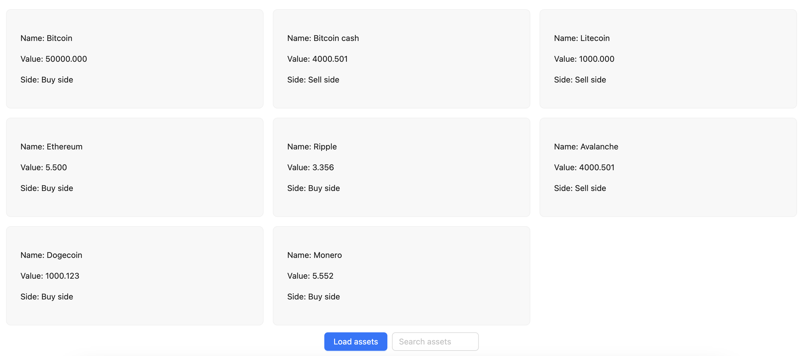

# Zero Hash React challenge

## Instructions
You should fetch a list of `Assets` from `mockApi` and use it to render a list of `Assets`.

### Requirements:
- Make a request to the `mockApi` and store the results
- Use the `Loading` component to represent the API loading state
- Display the `Assets list` using the `AssetsList` component
  - You should display the `name`, `value` and `side` of each Asset
  - The `value` should be fixed to 3 decimal places
  - The side, if `SELL_SIDE` should be displayed as `Sell`, if `BUY_SIDE` should be displayed as `Buy`
- The user should be able to search by `name` using the `Search input`
- Every time the `Search input` is changed (user types/erases text) a new request to the API should be made
- The `Load assets` button should centered on the bottom of the screen
- The `Search input` should also centered on the bottom of the screen
- The App should be responsive for `xs`, `sm` and `lg` screens, you can use `antd` `Col` and `Row` component for it

### Technical notes:
- Your code must be typed
- You can check the api response format on the `api-data.json` file
- The `side` attribute is an `enum` where the only possible values are `BUY_SIDE` and `SELL_SIDE`
- You should write at least one test

## Extra points
- Edit the `mockApi` function to return a generic typed response (receives `A` and returns data of type `A`, where `A` is a generic type)
- Add a debouncer to the `mockApi` call, you can use `lodash` or `ramda`

# Important Note
The scoring of this test will be done **ONLY** based on the code you wrote.
If you receive a Hackerrank score after finishing the challenge, please disregard that as it won't be taken into consideration on your hiring process.

## End result should be similar to the image below
